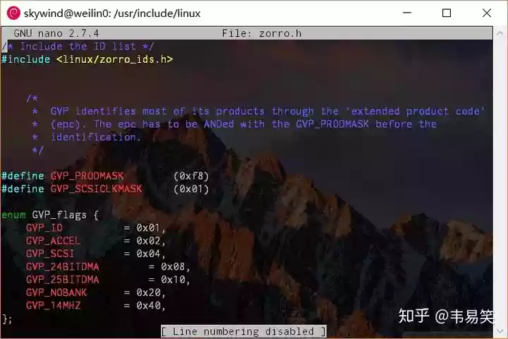
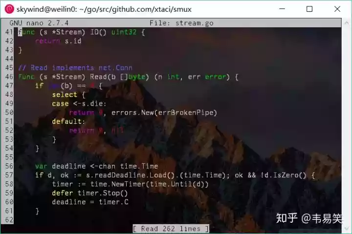
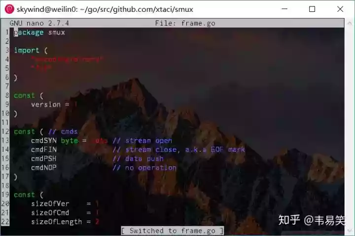
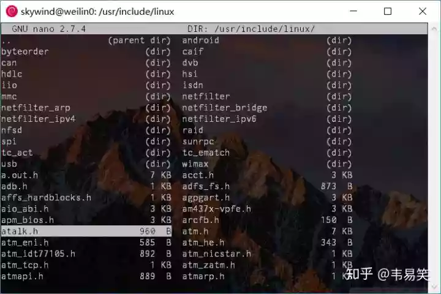

> **原文地址**：[https://zhuanlan.zhihu.com/p/47794948](https://zhuanlan.zhihu.com/p/47794948)

> 终端下如果你不喜欢 Vim/Emacs 的话，Nano 是一个不错的选择，它是一个真正意义上的跨平台编辑器，基本上在所有 Linux 发行版上都默认自带 Nano，并且有 Windows 版本。
> 不少初学 Linux 都很喜欢用 Nano，但是我发现他们很多都是在裸用，既没配置，也一直在用一些比较低效的操作方法。

## **Q：下面的帮助占三行，很碍眼，能否隐藏？**

可以在编辑时使用 ALT+x 就可以切换下面的帮助信息，或者在你的 ~/.nanorc 里面加一行：

    set nohelp 

效果如下图：



恩，那两行恶心的帮助已经被我们去掉了，需要时还可以用 ALT+x 把它切换回来。

## **Q：如何打开语法高亮？**

有的 Linux 发行版自带了 /etc/nanorc 文件，里面定义了语法高亮，而另外一些系统可能没有这个定义，你需要在 ~/.nanorc 中加一行：

    include "/usr/share/nano/*.nanorc"

各种语言的语法文件一般位于：`/usr/share/nano/` 下面，设置前先确认一下。

## **Q：怎么编辑 ~/.nanorc，常用设置有哪些？**

常见的 nano 配置如下：

```bash
set tabsize 4       # 设置制表符宽度
set autoindent      # 允许自动缩进
set cut             # 设置 CTRL-K 可以剪贴到行末
set noconvert       # 不要转换 DOS/UNIX 换行符
set nowrap          # 不要自动换行
set nohelp          # 不显示下面两行帮助
set morespace       # 隐藏标题下的空白行，换取更多编辑空间
set smooth          # 平滑卷屏
set suspend         # 允许 ctrl-z 将 nano 置于后台
set smarthome       # 第一次 Home 跳到行首非空字符，第二次到行首
set tabstospaces    # 展开制表符为空格（如果需要的话）
set mouse           # 允许鼠标
set linenumbers     # 显示行号（可以在编辑时 ALT-# 切换）
set backupdir path  # 设置备份路径
set backup          # 允许保存备份
set casesensitive   # 搜索使用大小写敏感
set multibuffer     # 使用 CTRL-r 读取文件时，默认读取到新缓存
set nonewlines      # 不在文件末尾添加新行
include <filename>  # 加载额外配置，通常是 /usr/share/nano 下的各种语法文件
```

上面配置因人而异，可以选择性添加，不过一般向类似：制表符宽度，隐藏帮助，显示行号，语法高亮，以及平滑卷屏等基本上是必开的选项：



经过调教，nano看起来比较顺眼了，你如果嫌弃行号碍眼，可以从 nanorc 里去除，或者需要的时候用 ALT+# 切换。

## **Q：如何复制粘贴？**

原来下面的帮助并没有复制粘贴的信息，一般用 ALT+a 开始选择，ALT+^ 复制选择的部分，CTRL+u 粘贴先前复制的东西。版本 2.7.4 以后可以 SHIFT+方向 直接选择，然后 ALT+^ 复制。

## **Q：如果 Redo/Undo ?**

ALT+u 可以撤销，ALT+e 可以重复。

## **Q：可以进行多文档编辑吗？**

见很多人用 Nano 都是命令行：nano <文件名> 编辑完以后 CTRL+O，CTRL+X 保存退出，然后再打开另外一个文件，编辑完又退出。其实 nano 下面可以很高效的同时打开多个文档进行编辑，然后用下面一组快捷键切换文件：

```bash
ALT+<    # 切换到上一个文件
ALT+>    # 切换到下一个文件
```

其实不用 ALT+SHIFT+, 来输入 ALT+<，有个简易快捷 ALT+, 直接等同于 ALT+<：



切换了文件后，最下面会显示现在切换到了哪个文件。

某个文件编辑完了可以 CTRL+X 关闭，如果所有文件都关闭了，就会退出 nano。打开新文件可以用 CTRL+r ALT+f ，然后输入文件名即可打开，输入文件名时可以用 TAB 进行补全。

很多人不知道，其实 Nano 中还自带一个“文件浏览器”，按 CTRL+R CTRL+T 后，打开浏览器选择文件界面，可以让你方便的在文本界面中选择希望打开的文件：



该界面下用方向键控制光标，回车键打开文件或者进入目录，CTRL+C 退出文件选择界面。

## **Q：哪里寻找更多关于 Nano 的使用帮助？**

其他 Nano 更多关于：复制，粘贴，搜索，替换的内容，见我制作的《Nano指令速查表》，除此之外，还有一些有用的网络资源：

最新下载：[https://www.nano-editor.org/](https://www.nano-editor.org/)
官方手册：[https://www.nano-editor.org/dist/v2.9/nano.html](https://www.nano-editor.org/dist/v2.9/nano.html)
中文帮助：[http://blog.sina.com.cn/s/blog_5d9f545101010b1y.html](http://blog.sina.com.cn/s/blog_5d9f545101010b1y.html)