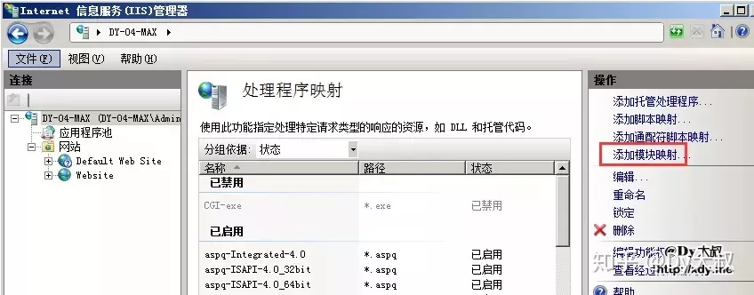
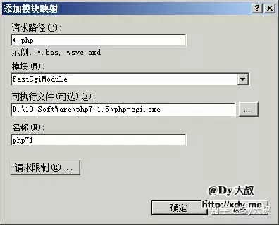

> 原文连接：[Windows7+IIS7+PHP+MySQL](https://zhuanlan.zhihu.com/p/44466181)
>
> 原文作者：**Dy大叔**

## 配置需求

* **操作系统**：Windows7(x32/x64), windows2008

* **IIS版本：** 7.0

* **PHP版本：** 7.0.6 及以上

* **MySQL版本：** 5.7.12 及以上


## 第一步：安装 IIS

> **注意：** 从IIS 7+PHP 5.5版本开始，Windows下PHP环境的配置完全不一样，相比之前版本的安装更快更轻松，配合FastCGI，只需鼠标简单操作一下就可以运行PHP环境。

### 1.找到”控制面板 => 程序和功能 => 打开或关闭Windows功能“


默认”Internet 信息服务“打勾安装

直接选择CGI，会自动安装FastCGI，不需要再安装ISAPI


### 2.新建网站目录

运行->**inetmgr**


右击”网站=>添加网站“


添加网站信息，一定按图片所示设置，除了路径自选


弹出”80端口占用“，意味着你将会有另一个网站【Default Web Site】同时占用80端口，解决办法：

1. 点击取消，返回修改端口，重新确定。
2. 点击确定，每次使用时，关闭其中一个网站


## 第二步：安装 PHP

**下载地址：[http://windows.php.net/download/](http://windows.php.net/download/)**

官网可以下载到Windows版的最新PHP包，但是[http://PHP.net](http://PHP.net)已经放弃5.6版以前的环境包，大叔这里整理了一份以前的环境包列表，有需要的同学可以自己去拿

**百度云盘：[https://pan.baidu.com/s/1BJgFhrCHRBj1VFkgGegZ8g](https://pan.baidu.com/s/1BJgFhrCHRBj1VFkgGegZ8g)**
**访问密码：11mh**

将PHP环境包解压后，找到php.ini-xxx文件

既然是本地开发测试，大叔建议：复制”php.ini-development“ 并粘贴，重命名为php.ini

> php.ini-development**（5.5版以后名称）**
> php.ini-dist**（5.5版以后名称）**
> 拥有较低的安全性设定，对权限设置适合开发程式使用php.ini-production
> php.ini-production**（5.5版以后名称）**
> php.ini-recommended**（5.5版以前名称）**
> 拥有较高的安全性设定，则适合正式上线的服务器中使用

### 配置 php.ini

#### 1.设置extension_dir插件

搜索并找到**extension_dir = ""**，在""里面输入PHP插件ext目录所在的位置，**extension_dir = "C:/ProgramFiles/XXX/XXX/php目录名/ext"**


搜索并找到**extension_dir=**，会找到插件目录列表，大叔建议打开以下插件（去掉前面”;“）维持大部分的PHP网站功能，如果有其他需求再打开其他插件（**注：配置一次PHP.ini就需要重启一次IIS**）

插件名插件功能

extension=php_bz2.dll | 压缩插件
extension=php_curl.dll | 远程粘贴
extension=php_gd2.dll | GD库
extension=php_mbstring.dl | l短标签
extension=php_mysql.dll | MySQL老引擎
extension=php_mysqli.dll | MySQL新引擎
extension=php_pdo_mysql.dll | MySQLPDO连接


#### 2.设置时区：date.timezone = Asia/Shanghai


#### 3.IIS 添加 PHP 支持

运行->**inetmgr**


打开：**处理程序映射**


打开：**添加模块映射**



填写如下内容



确定会有提示，点击”确定“


映射程序添加成功，列表中会有一条PHP程序映射记录


这样一个**IIS**+**PHP**环境就搭建好了。

#### PHP包：版本/型号区别

* 5.5版本之前
  Windows配置IIS+PHP，需要安装VC9
  Windows配置Apache+PHP，需要安装VC6
* 5.5版本之后只有VCXX了，只要选线程方式和32位/64位系统就可以了
  Non Thread Safe是指非线程安全，Thread Safe则是指线程安全
  使用ISAPI的方式来运行PHP就必须用Thread Safe(线程安全)的版本
  使用FastCGI模式运行PHP的话就没有必要用线程安全检查了，用None Thread Safe(NTS，非线程安全)的版本能够更好的提高效率

## FastCGI 进程错误汇总

### 错误1：php-cgi.exe - FastCGI 进程意外退出

打开**[http://localhost](http://localhost)**页面，提示以上错误，95%以上就是环境对应的VC版本没装对。

你需要寻找PHP VC号对应的Visual C++ Redistributable for Visual Studio开发版本：

VC6 | VC6.0
VC7 | VS2002
VC7.1 | VS2003
VC8 | VS2005
VC9 | VS2008
VC10 | VS2010
VC11 | VS2012
VC12 | VS2013
VC13 | VS2014
VC14 | VS2015

**5.5**版本需要安装 VS2012
**5.7**版本需要安装 VS2015

### 错误2：发生未知 FastCGI 错误错误代码为0x8007010b

如果之前的安装严格按照本文所述，那应该考虑权限问题，是否把PHP、Apache、MySQL程序放置在了C盘的严控权限位置（比如**桌面**）。

将程序文件夹添加人员**【Everyone】，权限为【所有】**，重新刷新页面即可。

## 第三步：安装 MySQL

**下载地址：[https://dev.mysql.com/downloads/mysql/](https://dev.mysql.com/downloads/mysql/)**

**百度云盘：[https://pan.baidu.com/s/19ffxCVYgTUbmMzNwI8CB6g](https://pan.baidu.com/s/19ffxCVYgTUbmMzNwI8CB6g)**
**访问密码：l5fb**

> 大叔建议使用免安装版，使用CMD方式安装，是最容易熟悉MySQL的方法，本文的安装流程是以绿色版为标准。
> 百度网盘是本文配套的MySQL 5.7 官方免安装版

进入官网下载页面，拖至最下面，或在页面搜索 **Other Downloads:**


32位系统下载：**Windows (x86, 32-bit), ZIP Archive**
64位系统下载：**Windows (x86, 64-bit), ZIP Archive**

### 配置 my.ini

在 **my.ini** 中，一定要存在下面的字符，如果不存在，就自己码进去，然后保存，

```ini
[mysqld]
#skip-grant-tables #这名加上可以跳过验证
basedir= C:/User/Administrator/XXX/XXX/mysql-noinstall-5.1.53-win32 #根目录
#datadir=C:/User/Administrator/XXX/XXX/mysql-noinstall-5.1.53-win32/data #数据文件存放目录
```


### 2.人工安装 MySQL

打开**CMD**控制台


通过**CMD**的 **cd** 命令，进入MySQL的根目录下的**bin文件夹**


在**bin**文件夹下分别输入下面三条指令：

```mysql
mysqld --install MySQL  回车（成功会提示，S开头字母）
mysqld -remove          回车（如果安装位置出错，就用这个命令删除配置，然后重新安装。）
net start mysql         回车（成功会提示服务已经运行）
```

如果安装成功，就可以通过**CMD**命令，轻松开启/关闭**MySQL**了


**注意：保存【my.ini】时编码一定设为Ansi，否则会报如下错误**

> error: Found option without preceding group in config file: D:\Program Files\mysql-5.6.25-winx64\my.ini at line: 1
> Fatal error in defaults handling. Program aborted。

这时，你在**CMD**中运行**net start mysql**命令，恭喜，你进入了MySQL的的卡死循环状态中。

### 错误提示解决方案汇总

#### 1.服务无法启动

> C:XXX>mysql>bin>net start mysql
> MySQL 服务正在启动 ....
> MySQL 服务无法启动。
> 服务没有报告任何错误。
> 请键入 NET HELPMSG 3534 以获得更多的帮助。

解决方案：[【MySQL】服务无法启动，服务没有报告任何错误的解决办法](https://www.jianshu.com/171)

#### 2.新安装MySQL，Root空密码无法登录

> MySQL> mysql -u root -p
> Enter password:
> ERROR 1045 (28000): Access denied for user 'root'@'localhost' (using password: YES)

解决方案：[【MySQL】免安装版安装并启动成功后，无法登录，root帐户密码强制重设](https://www.jianshu.com/172)

## 第四步：设置伪静态

### 1.下载 IIS 7 的 Microsoft URL 重写模块 2.0 模板

官网64位：[http://www.microsoft.com/zh-cn/download/details.aspx?id=7435](http://www.microsoft.com/zh-cn/download/details.aspx?id=7435)
官网32位：[http://www.microsoft.com/zh-cn/download/details.aspx?id=5747](http://www.microsoft.com/zh-cn/download/details.aspx?id=5747)
IIS URL Rewrite下载地址：[http://www.iis.net/download/URLRewrite](http://www.iis.net/download/URLRewrite)

### 2.设置web.config

```ini
<rewrite>
<rules>
<rule name="Rewrite to index.php" stopProcessing="true">
<match url="^index.html" />
<action type="Rewrite" url="index.php" />
</rule>
<rule name="Rewrite to article.php" stopProcessing="true">
<match url="^article_(d+).html" />
<action type="Rewrite" url="article.php?id={R:1}" />
</rule>
<rule name="Rewrite to list.php" stopProcessing="true">
<match url="^list_(d+)_(d+).html" />
<action type="Rewrite" url="list.php?id={R:1}&page={R:2}" />
</rule>
<rule name="Rewrite to category.php" stopProcessing="true">
<match url="^(.*)" />
<action type="Rewrite" url="category.php?category={R:1}" />
</rule>
</rules>
</rewrite>
```


###  其他问题

#### 问题1：File upload error - unable to create a temporary file in Unknown on line 0

原因：因为PHP的临时目录为不可读写

解决方案：

1. 打开 **php.ini** 找到 **upload_tmp_dir**
2. 找一个位置为php上传临时目录，然后 **upload_tmp_dir = "D://upload/"**

#### 问题2：PHP Notice: Undefined variable

原因：PHP默认的配置会报这个错误，虽然有利于发现错误，但同时实践中会出现很多问题。

解决方法：

**方法1**：修改 **php.ini **配置文件 **error_reporting **设置：

1. 找到 **error_reporting = E_ALL**
2. 修改为 **error_reporting = E_ALL & ~E_NOTICE**

原理：减弱PHP的敏感程度，使其遇到这种问题不报错。（不推荐这种方式，会导致你错误的语法继续出错）

**方法2**：在PHP文件头部加入以下代码

```php
<?php
  ini_set("error_reporting","E_ALL & ~E_NOTICE");
?>
```

同样也可以解决问题，但同样不推荐，这个方法。

**方法3：修正你的语法，让你的代码更规范！！！**

## 附录

### Windows 2008 R2 IIS角色安装方法

> Windows 2008 R2是服务器版本，所以安装IIS7时和非服务器版有些不同，需要使用角色系统安装

#### 第一步：安装IIS

首先进入”控制面板=>打开或关闭Windows功能“


服务器版本进入的是**服务器管理器**，我们需要进入**【角色】**并添加角色来增加IIS功能


进入引导页，点击”下一步“


打勾”Web 服务器(IIS)“，点击下一步


一路下一步，记得把 **CGI **勾选上，不要勾选 **ISAPI**

等待安装过程

最后显示”安装成功 “，即大功告成。


#### Windows 10：MySQL my.ini 与 Windows7 不通用

> Windows 7/8/10/2008R2 都使用了IIS7，使用及安装的方法几乎一致，但因为微软的老毛病，系统不同的情况下，Bug也会不同，这里大叔记录了一些安装其他系统时遇到一些情况记录。

MySQL的 **my.ini** 文件，各个系统之间不能通用，所以在安装时，无法直接把Windows7的MySQL直接移植过去，大叔就重写了 **my.ini** 就可以正常使用了。

```ini
[WinMySQLAdmin]
Server="C:/Users/Administrator/***/***/***/mysql-5.7.16/bin/mysqld.exe" 
[client] 
no-beep 
# pipe 
# socket=mysql 
port=3306 
[mysql]
default-character-set=utf8 

# For advice on how to change settings please see 
# http://dev.mysql.com/doc/refman/5.6/en/server-configuration-defaults.html 
# *** DO NOT EDIT THIS FILE. It's a template which will be copied to the 
# *** default location during install, and will be replaced if you 
# *** upgrade to a newer version of MySQL. 
[mysqld] 
explicit_defaults_for_timestamp = TRUE

# Remove leading # and set to the amount of RAM for the most important data 
# cache in MySQL. Start at 70% of total RAM for dedicated server, else 10%. 
innodb_buffer_pool_size = 2G 

# Remove leading # to turn on a very important data integrity option: logging 
# changes to the binary log between backups. 
# log_bin 

# These are commonly set, remove the # and set as required. 

#basedir="C:\mysql-5.7.11-win32\" 
basedir = "C:\Users\Administrator\***\***\***\mysql-5.7.16\"
#datadir="C:\mysql-5.7.11-win32\data\" 
datadir = "C:\Users\Administrator\***\***\***\mysql-5.7.16\data\"

port=3306 
server_id=1 

general-log=0 
general_log_file="mysql_general.log" 
slow-query-log=1 
slow_query_log_file="mysql_slow_query.log" 
long_query_time=10 
log-error="mysql_error_log.err" 
default-storage-engine=INNODB 
max_connections=1024 
query_cache_size=128M 
key_buffer_size=128M 
innodb_flush_log_at_trx_commit=1 
innodb_thread_concurrency=128 
innodb_autoextend_increment=128M 
tmp_table_size=128M 

# Remove leading # to set options mainly useful for reporting servers. 
# The server defaults are faster for transactions and fast SELECTs. 
# Adjust sizes as needed, experiment to find the optimal values. 
# join_buffer_size = 128M 
# sort_buffer_size = 2M 
# read_rnd_buffer_size = 2M 

#sql_mode=NO_ENGINE_SUBSTITUTION,STRICT_TRANS_TABLES 
sql-mode="STRICT_TRANS_TABLES,NO_AUTO_CREATE_USER,NO_ENGINE_SUBSTITUTION" 
character-set-server=utf8 
innodb_flush_method=normal
</pre>
```